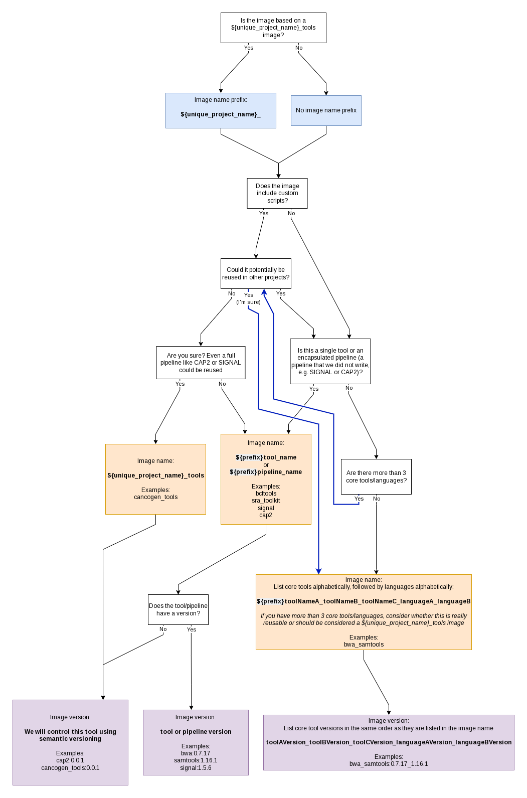

# bioinformatics-public-docker-images

This repository contains public docker images used for workflow execution.

DNAstack's public images built from the files in this repository are hosted [on Dockerhub](https://hub.docker.com/u/dnastack).


## Directory structure

Each tool or set of tools should have its own directory containing at minimum two files: a `Dockerfile`, and a `build.env` file. If docker definitions for multiple versions of the same tool exist (e.g. samtools version 0.19 and version 1.15), they can be further divided into subdirectories within the `samtools` directory, named by the tool version. Each of these version subdirectories should contain a `Dockerfile` and a `build.env` file.

The `build.env` file is used to specify the name and version tag for the docker image defined by the corresponding `Dockerfile`. It must contain at minimum the following variable:

- `IMAGE_NAME`
- `IMAGE_TAG`

Additional variables can be added to the `build.env` file; all variables defined in the `build.env` file will be made available when the docker image is being built as build arguments.

The `IMAGE_TAG` variable can be built using other env variables defined in the `build.env` file, as long as those other variables are defined before the `IMAGE_TAG` definition. For example, the following `IMAGE_TAG` would be set to 0.7.8_1.15:

```
IMAGE_NAME=bwa_samtools
BWA_VERSION=0.7.8
SAMTOOLS_VERSION=1.15
IMAGE_TAG=${BWA_VERSION}_${SAMTOOLS_VERSION}
```

The variable `NOBUILD` can be set to `true` to enable skipping the associated Docker image build when running the `build_docker_images` script.

See [image naming and versioning](#image-naming-and-versioning) for information on how images should be named and versioned.


Example directory structure:
```
bioinformatics-public-docker-images
├── bcftools_r
│   ├── build.env
│   └── Dockerfile
├── bwa_samtools
│   ├── build.env
│   └── Dockerfile
├── samtools
│  ├── 0.19
│  │   ├── build.env
│  │   └── Dockerfile
│  └── 1.15
│      ├── build.env
│      └── Dockerfile
...
├── toolA
│   ├── build.env
│   └── Dockerfile
└── toolA_toolB
    ├── build.env
    └── Dockerfile
```

Docker images can be built and tagged using [the build_docker_images script](./build_docker_images).

```bash
# build all docker images in the repo
./build_docker_images

# build docker images found in a directory (and its subdirectories)
./build_docker_images -d some_path

# tag images using the provided container registry
./build_docker_images -c dnastack

# build and push docker images to the provided container registry
./build_docker_images -c dnastack -p
```


## Image naming and versioning

Follow this handy flowchart!




## General best practices

- The Dockerfile should always be named Dockerfile
- Do not write secrets into docker images; if secrets are needed as part of workflow execution, they should be provided as workflow inputs
- Avoid adding large reference files to docker images where possible; provide as workflow inputs
- Do not use the `latest` tag unless you _really_ need things to update automatically; this is prone to breaking
- OS repos and versions of tools in these repos change; prioritize installing tools directly from source
- The `Dockerfile` should consume all build arguments defined in the `build.env` file, e.g. by setting them as image environment variables
